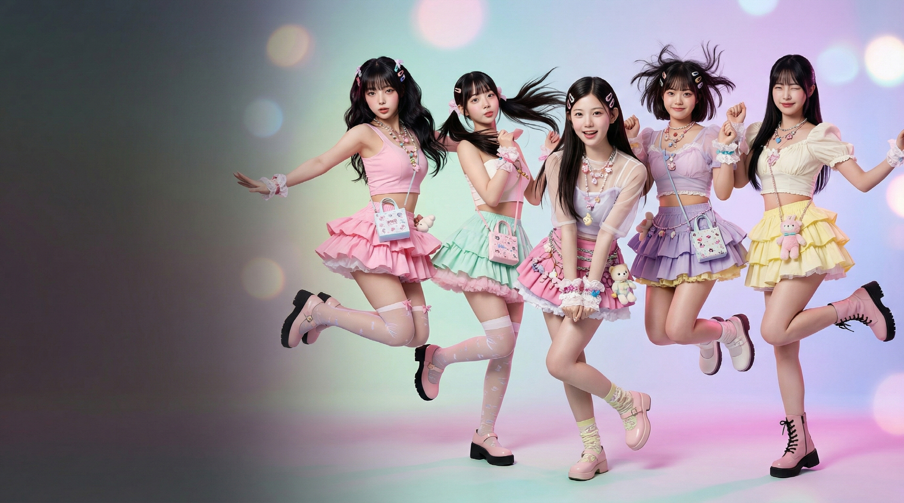

🌐 Official Website: https://myblin9.com

[](https://github.com/AIV48/myblin9/raw/main/assets/videos/sweeteez.mp4)


# myblin9

AI entertainment platform focused on AI idols, virtual characters, and immersive fan interaction.

---

## Features

- AI idol interaction
- Long-term memory chat system
- Virtual entertainment content
- AI-generated music videos
- Community-driven character ecosystem
- AI-assisted media production
- Virtual fan engagement workflows

---

## Vision

myblin9 aims to build the next-generation AI entertainment ecosystem combining K-pop culture, AI personalities, and fan engagement.

The platform explores:
- persistent AI character memory
- virtual idol interaction
- AI-generated media pipelines
- fan-driven character evolution
- immersive entertainment experiences

---

## Tech Stack

- Python
- Node.js
- React
- Vector Database
- LLM Memory System
- Stable Diffusion
- AI Video Generation
- Generative Audio Pipeline
- Cloud Infrastructure
- Real-time Messaging

---

## Research Areas

- AI idol identity consistency
- virtual character memory
- generative video production
- AI-assisted music creation
- prompt engineering for entertainment content
- fan interaction systems
- cinematic AI MV workflows
- multi-character generation consistency

---

## Production Workflow

The project documents an AI-assisted creative pipeline for developing virtual idols, music videos, character assets, and fan-facing entertainment experiences.

### Pipeline Overview

1. Character concept development
2. Identity-consistent visual generation
3. AI-assisted music production
4. Generative video workflows
5. Motion refinement and editing
6. Publishing and fan engagement

---

## Current Development

- AI idol interaction systems
- persistent memory architecture
- generative MV workflows
- virtual fan engagement systems
- AI-assisted media production
- frontend interaction prototypes

---

## Repository Structure

```txt
docs/       → research and workflow documentation
ai/         → AI workflow notes and prompt engineering
frontend/   → frontend prototype and UI experiments
assets/     → concept art, promotional assets, preview images, and demo video
api/        → API specifications and backend structure
